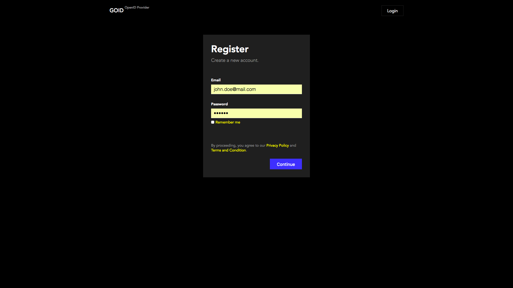
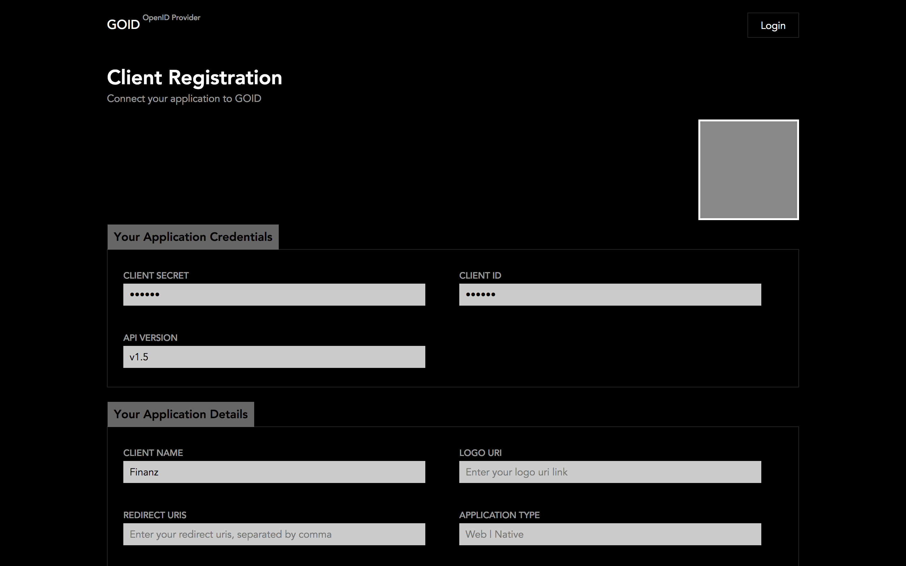
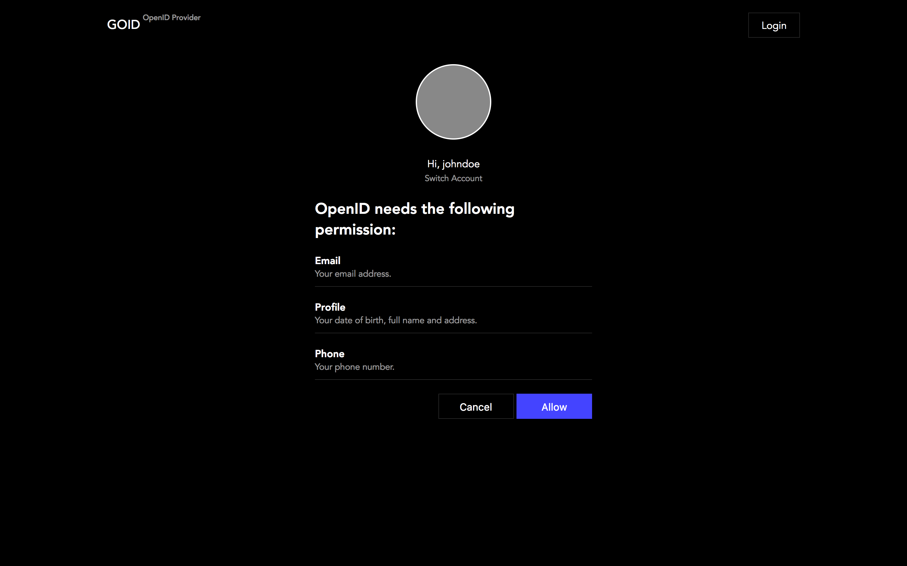
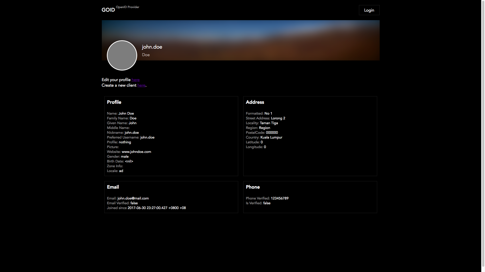
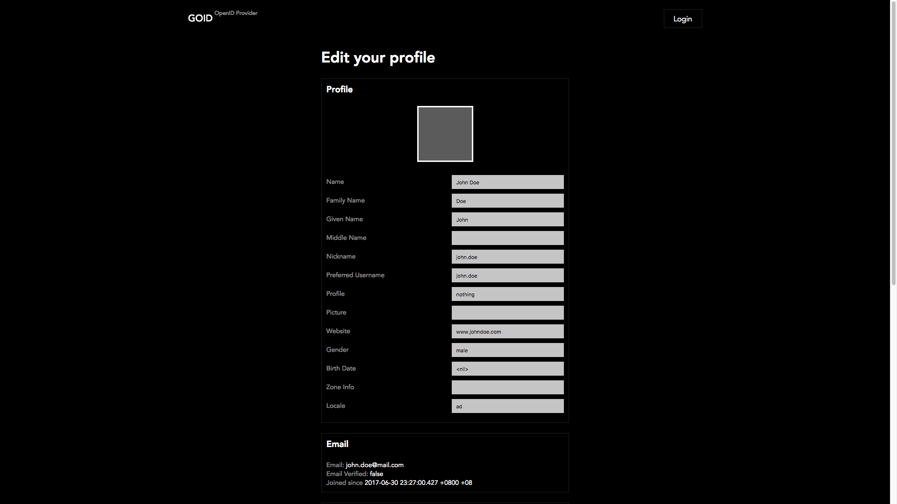

# OpenID Connect with golang

Building an openid connect implementation with golang (WIP)

The login screen UI is deprecated and has since switched to dark theme. See the register screen:

## Todos
- [ ] Reading Config
- [ ] Validating Model
- [ ] JWT
- [ ] Hashing Password

http://localhost:8080/authorize?client_id=5968f982acef4a17ce18bdc3&response_type=code&redirect_uri=localhost:8080/cb&scope=openid

