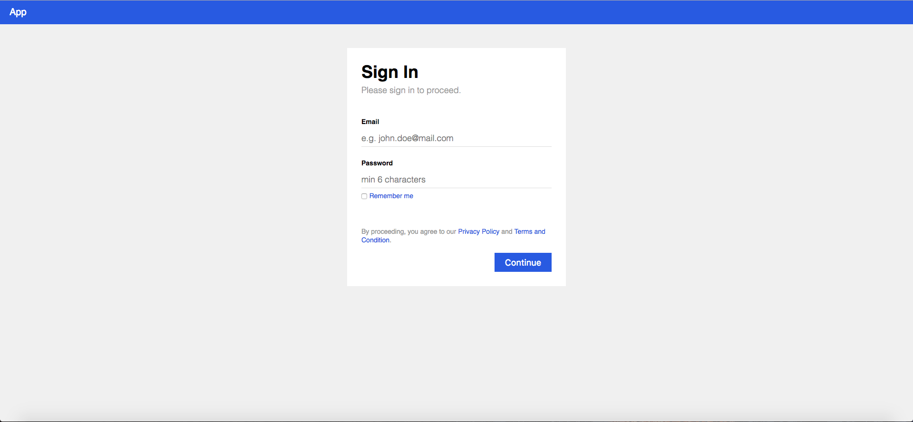

# OpenID Connect with golang

Building an openid connect implementation with golang (WIP)




## Todos
- [ ] Reading Config
- [ ] Validating Model
- [ ] JWT
- [ ] Hashing Password


## Reading Config
## Validating Model
```go
import "gopkg.in/go-playground/validator.v9"

// use a single instance of Validate, it caches struct info
var validate *validator.Validate

func main() {
    validate = validator.New()
    a := Email{Gender: "malea", Value: "john.doe@mail.com"}
    err := validate.Struct(a)
    if err != nil {
        fmt.Println("error: " + err.Error())
    }
}
```

